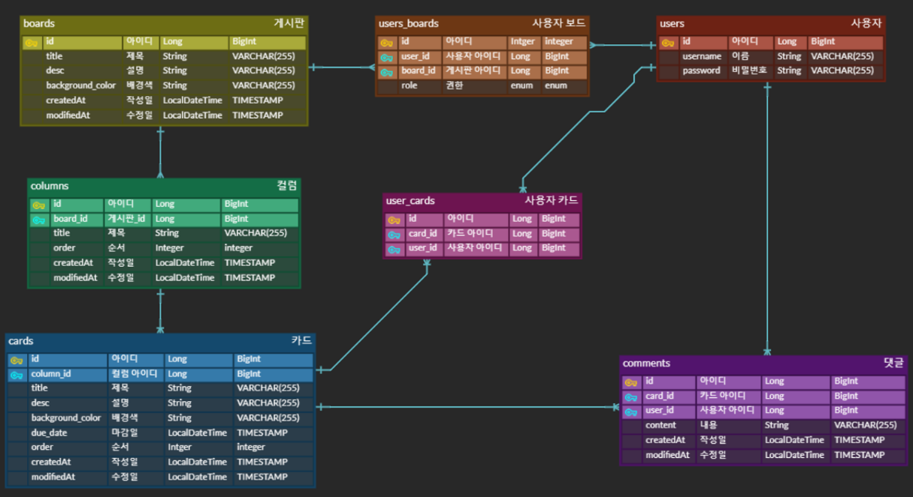

# 프로젝트 협업 도구 만들기

---
### 🍄 협업 관리 툴
- 프로젝트 소개 :
  - 프로젝트를 진행하다보면 누가, 무엇을, 언제까지 해야하는지 명확히 명시가 되어있으면 보다 효율적으로 프로젝트를 진행할 수 있을 것 입니다.
    그렇기에 협업을 할 때 작업의 배분, 진행 현황 등을 관리하는 협업 툴을 만들어 보았습니다.
---
## 🍄 준비사항
### 🍄 Git convention
- feat : 새로운 기능 추가
- hotfix : 급하게 치명적인 버그 수정
- docs : 문서 수정
- fix : 코드 수정
- style : 코드 포맷팅(code formatting), 세미콜론(;) 등의 스타일 수정 (코드 자체 수정 X)
- refactor : 프로덕션 코드 리팩토링
- test : 테스트 코드, 테스트 코드 리팩토링
- chore : 빌드 과정 또는 보조 기능(문서 생성 기능 등) 수정
- rename : 파일 혹은 폴더명을 수정하거나 옮기는 작업만인 경우
- comment : 필요한 주석 추가 및 번경

### 🍄 Git branch 전략
● 메인브랜치(main branch)
- master : 제품으로 출시될 수 있는 브랜치
- develop : 다음 출시 버전을 개발하는 브랜치

● 보조 브랜치(sub branch)
- feature : develop 브랜치에 새로 추가할 기능을 개발하는 브랜치
- release : develop 브랜치 개발이 완료되면 출시버전을 준비하면서 QA, TEST를 위해서 사용하는 임시 브랜치
- hotfix : 마스터 브랜치(master branch)에서 발생한 버그를 수정하는 브랜치
---
## 🍄 ERD

---
## 🍄 API 명세
https://documenter.getpostman.com/view/30861162/2s9YsDkvB6#afcf5dae-26e3-48d2-9265-c4f831c6ea2c

---
## 🍄 기능 구현
- **사용자 관리 기능**
    - [x]  로그인 / 회원가입 기능
    - [x]  사용자 정보 수정 및 삭제 기능
- **보드 관리 기능**
    - [x]  보드 생성
    - [x]  보드 수정
        - 보드 이름
        - 배경 색상
        - 설명
    - [x]  보드 삭제
        - 생성한 사용자만 삭제를 할 수 있습니다.
    - [x]  보드 초대
        - 특정 사용자들을 해당 보드에 초대시켜 협업을 할 수 있어야 합니다.
- **컬럼 관리 기능**
    - [x]  컬럼 생성
        - 보드 내부에 컬럼을 생성할 수 있어야 합니다.
        - 컬럼이란 위 사진에서 Backlog, In Progress와 같은 것을 의미해요.
    - [x]  컬럼 이름 수정
    - [x]  컬럼 삭제
    - [x]  컬럼 순서 이동
        - 컬럼 순서는 자유롭게 변경될 수 있어야 합니다.
            - e.g. Backlog, In Progress, Done → Backlog, Done, In Progress

- **카드 관리 기능**
    - [x]  카드 생성
        - 컬럼 내부에 카드를 생성할 수 있어야 합니다.
    - [x]  카드 수정
        - 카드 이름
        - 카드 설명
        - 카드 색상
        - 작업자 할당
        - 작업자 변경
    - [x]  카드 삭제
    - [x]  카드 이동
        - 같은 컬럼 내에서 카드의 위치를 변경할 수 있어야 합니다.
        - 카드를 다른 컬럼으로 이동할 수 있어야 합니다.

- **카드 상세 기능**
    - [x]  댓글 달기
        - 협업하는 사람들끼리 카드에 대한 토론이 이루어질 수 있어야 합니다.
    - [x]  날짜 지정
        - 카드에 마감일을 설정하고 관리할 수 있어야 합니다.